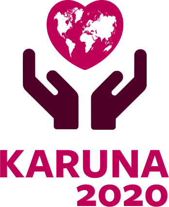
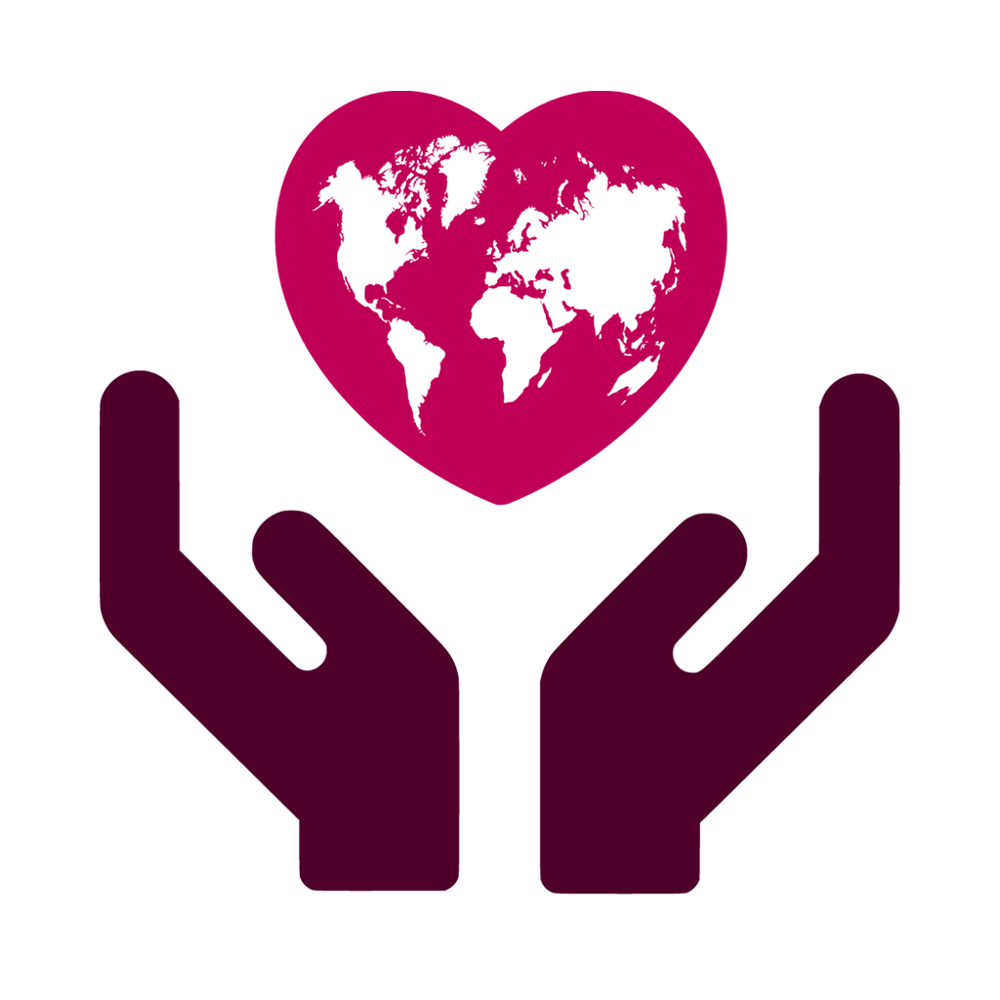

<h1>&nbsp; Karuna 2020 Branding</h1>

This repository contains our static assets and serves them to our CDN.

## 🖼️ Assets

<table>
  <tr>
    <td style="text-align: center">
      
      
SVG logo

      

        <a href="https://cdn.karuna2020.org/logo-vertical.svg">CDN link</a>
      

    </td>
    <td style="text-align: center">
      
      
SVG icon

      

        <a href="https://cdn.karuna2020.org/icon-colored.svg">CDN link</a>
      

    </td>
    <td style="text-align: center">
      
      
PNG icon

      

        <a href="https://cdn.karuna2020.org/icon-colored.png">CDN link</a>
      

    </td>
    <td style="text-align: center">
      
      
Black SVG icon

      

        <a href="https://cdn.karuna2020.org/icon-black.svg">CDN link</a>
      

    </td>
  </tr>
</table>

## 🌈 Colors

<table>
  <tr>
    <td style="text-align: center">
      
      
<code>#e02020</code>

    </td>
    <td style="text-align: center">
      
      
<code>#4e0000</code>

    </td>
    <td style="text-align: center">
      
      
<code>#1f0000</code>

    </td>
  </tr>
</table>

## 💡 How it works

- We store our static assets in this repository
- GitHub Pages publishes them to our CDN

**CDN endpoint:** https://cdn.karuna2020.org

For example, our logo is available at https://cdn.karuna2020.org/logo-vertical.svg

## 📄 License

Our logo and other static assets are available under [CC BY 4.0](https://creativecommons.org/licenses/by/4.0/). Our logo is based on [Compassion](https://thenounproject.com/search/?q=compassion&i=2051438) by [Nociconist](https://thenounproject.com/nociconist) and [World Map](https://thenounproject.com/search/?q=world%20map&i=1336296) by [GREY Perspective](https://thenounproject.com/ar_vigneshraja) from [The Noun Project](https://thenounproject.com), both licensed [CC BY 3.0](https://creativecommons.org/licenses/by/3.0/).
